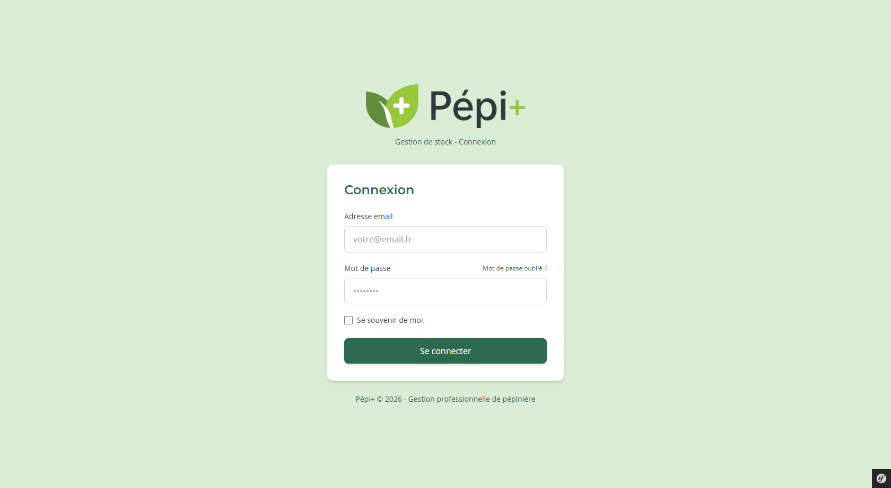
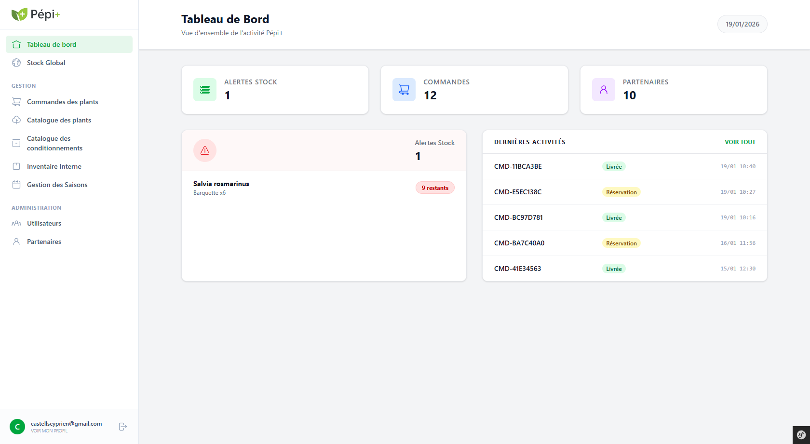
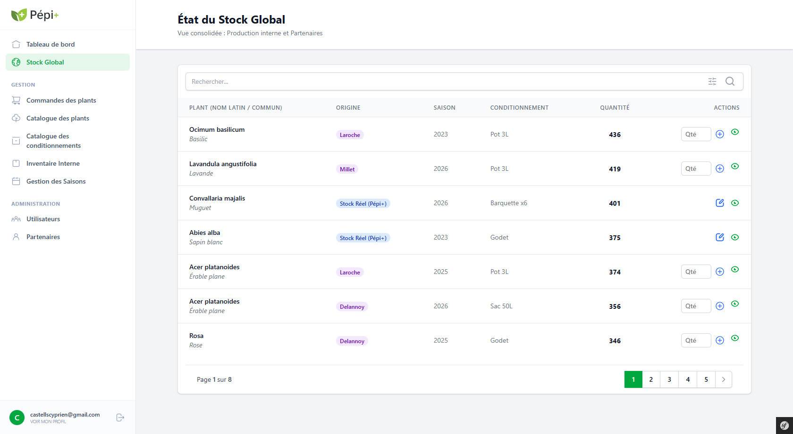

# Pépi+ - Gestion de Stock Pépinière

<div align="center">


**Application web de gestion de stock pour pépiniéristes**

*Projet BTS SIO SLAM 2025/2026*

[Documentation](#documentation) • [Installation](#installation) • [Démo](#comptes-de-test)

</div>

---

##  À propos du projet

Pépi+ est une application web complète permettant aux pépiniéristes de gérer efficacement leurs stocks de plants, leurs commandes et leurs partenaires fournisseurs. L'application répond à la traçabilité correspond aussi aux régles UI/UX.

### Objectifs

- Gestion du stock réel (production interne) et virtuel (partenaires)
- Traçabilité complète des plants (origine, saison, conditionnement)
- Gestion des commandes avec réservation automatique
- Interface distincte pour les collaborateurs et les partenaires
- Tableau de bord

---

## Aperçu de l'application

<div align="center">

### Page de connexion


### Tableau de bord


### Gestion du stock global


</div>

---

## Fonctionnalités principales

### Pour les collaborateurs

- **Tableau de bord interactif**
  - Vue d'ensemble de l'activité
  - Alertes stock en temps réel
  - Dernières commandes
  
- **Gestion complète des stocks**
  - Visualisation du stock global (réel + virtuel)
  - Recherche et filtres avancés
  - Traçabilité complète

- **Gestion des commandes**
  - Création et modification des commandes
  - Réservation automatique des plants disponibles
  - Historique des statuts
  - Impact automatique sur les stocks
  
  - **Administration**
  - Gestion des utilisateurs (collaborateurs et partenaires)
  - Gestion des partenaires fournisseurs
  - Catalogue des plants (noms latin/commun, types)
  - Gestion des conditionnements et saisons
  
### Pour les admin

- **Administration**
  - Gestion des utilisateurs (collaborateurs et partenaires)
  - Gestion des partenaires fournisseurs
  - A les même droit que les collaborateur

### Pour les partenaires

- Gestion de leur stock
- Consultation des réservations effectuées

### Sécurité

- Authentification sécurisée par email/mot de passe
- Système de rôles (ADMIN, COLLABORATOR, PARTNER)
- Réinitialisation de mot de passe par email

---

## Technologies utilisées

- **Backend** : Symfony 7.4 (PHP 8.2+)
- **Frontend** : TailwindCSS 4.1, Twig
- **Base de données** : MySQL 8.0
- **Build** : Webpack Encore
- **Bundles** : Doctrine ORM, Security Bundle, KnpPaginator, Mailer

---

## Installation

### Prérequis

Assurez-vous d'avoir installé :
- PHP 8.2 ou supérieur
- Composer
- MySQL 8.0
- Node.js et npm
- Symfony CLI (optionnel)

### Étapes d'installation

1. **Cloner le projet**
```bash
git clone https://github.com/CASTELLS-Cyprien/PEPI-PLUS.git
cd PEPI-PLUS
```

2. **Installer les dépendances PHP**
```bash
composer install
```

3. **Installer les dépendances JavaScript**
```bash
npm install
```

4. **Configurer la base de données**

Créez un fichier `.env.local` à la racine du projet :
```env
DATABASE_URL="mysql://root:@127.0.0.1:3306/pepi?charset=utf8mb4"
```

5. **Créer et initialiser la base de données**
```bash
php bin/console doctrine:database:create
php bin/console doctrine:migrations:migrate
php bin/console doctrine:fixtures:load
```
Si besoin, les exports de la base de données sont stockés dans **/var/backups/db_export_xxxx-xx-xx.sql**


6. **Compiler les assets**
```bash
npm run build
```
Pour le développement avec rechargement automatique :
```bash
npm run watch
```

7. **Lancer le serveur**
```bash
symfony server:start
```

L'application est maintenant accessible sur **http://localhost:8000**

---

## Comptes de test

Pour tester l'application, utilisez les identifiants suivants :

| Rôle | Email | Mot de passe |
|------|-------|--------------|
| **Administrateur** | castellscyprien@gmail.com | `Qye!9IE8$^EuQhKB` |
| **Collaborateur** | collaborateur@gmail.com | `password` |
| **Partenaire** | partner@gmail.com | `password` |

---

### Schémas disponibles

Les schémas détaillés sont disponibles dans le dossier `assets/` :
- **MCD** (Modèle Conceptuel de Données) : `assets/MCD.pdf`
- **MLD** (Modèle Logique de Données) : `assets/MLD.pdf`

---

## Structure du projet

```
PEPI-PLUS/
├── assets/              # Documentation (MCD, MLD, CDC)
├── config/             # Configuration Symfony
├── public/             # Point d'entrée et assets compilés
│   └── img/            # Captures d'écran
├── src/
│   ├── Controller/     # Contrôleurs
│   ├── Entity/         # Entités Doctrine
│   ├── Form/           # Formulaires
│   ├── Repository/     # Repositories
│   └── Security/       # Configuration sécurité
├── templates/          # Templates Twig
└── migrations/         # Migrations de base de données
└── var/
    └── backups/        # Export de base de données 
```

---

## Documentation

### Documents disponibles

Tous les documents sont disponibles dans le dossier `assets/` :

- **Cahier des charges** : `assets/CdC_PepiPlus.pdf`
- **MCD** (Schéma conceptuel) : `assets/MCD.pdf`
- **MLD** (Schéma logique) : `assets/MLD.pdf`

### Commandes utiles

```bash
# Créer une nouvelle migration
php bin/console make:migration

# Exécuter les migrations
php bin/console doctrine:migrations:migrate

# Charger les fixtures (données de test)
php bin/console doctrine:fixtures:load

# Vider le cache
php bin/console cache:clear
```


## Contexte académique

Ce projet a été réalisé dans le cadre du BTS SIO option SLAM (Solutions Logicielles et Applications Métiers) pour l'année 2025/2026.

---

## Contact

Pour toute question concernant le projet :
- Email : castellscyprien@gmail.com
- GitHub : [@CASTELLS-Cyprien](https://github.com/CASTELLS-Cyprien)

---

<div align="center">

**Projet réalisé dans le cadre du BTS SIO SLAM**

*Pépi+ © 2026 - Gestion professionnelle de pépinière*

</div>